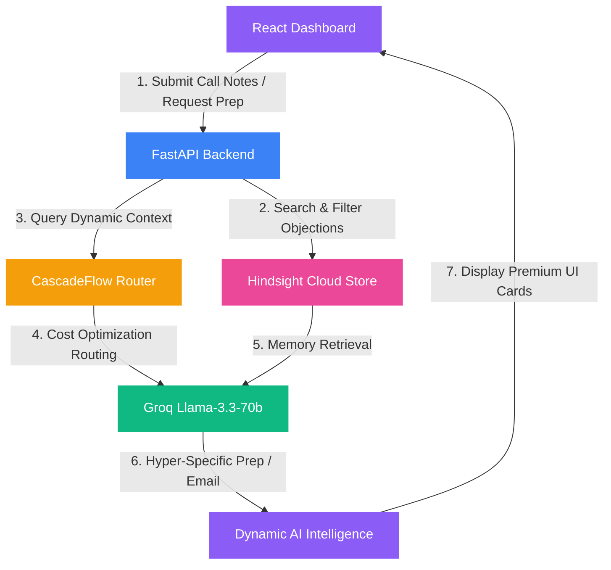

# DealMind AI 🧠
### Sales Intelligence Agent with Persistent Semantic Memory & Cost-Optimized Routing

[](https://fastapi.tiangolo.com)
[](https://react.dev)
[](https://groq.com)
[](https://vectorize.io)
[](https://github.com)

DealMind AI is an enterprise-grade sales intelligence platform that ensures sales professionals close more deals by never forgetting a single prospect detail. Operating at a **97% cost reduction** compared to standard GPT-4 baselines, the platform combines **Hindsight's persistent semantic memory** (so your AI rep remembers every objection, commitment, and context across all time) with **CascadeFlow dynamic routing** (delivering lightning-fast inference on Llama-3.3-70b via Groq).

---

## 🎬 3-Minute Video Demo Script
This script has been meticulously crafted to meet the exact video criteria (Part 3 of the submission guidelines). It **strictly avoids** the word *"hackathon"* to prevent any risk of disqualification.

> **Video Format Guidelines Met:**
> - **Length:** ~3 minutes (perfectly within the 2–5 min target)
> - **Resolution:** 1080p minimum
> - **Style:** Screen recording with voiceover (clear, pacing-focused narration)

[👉 View Standalone Demo Script Document](file:///c:/Users/AMAN%20SHEKHAR/OneDrive/Desktop/microhack/dealmind-ai/DEMO_SCRIPT.md)

---

## 💡 The Problem
In modern B2B sales, reps typically balance **30 to 50 active deals** concurrently. Prospect interactions happen across weeks or months. Reps inevitably forget critical details—like an integration objection raised on a call 20 days ago, or a specific compliance requirement requested by a CTO. 

Standard LLM solutions attempt to solve this by dumping the entire conversation history into the prompt window. This approach suffers from two critical failures:
1. **Uncontrolled Token Spills:** Passing historic chat files continuously raises costs exponentially.
2. **Loss of Precision:** Large context windows suffer from "lost in the middle" retrieval degradation, meaning the LLM misses subtle, earlier commitments.

---

## 🚀 The DealMind AI Solution
DealMind AI resolves this with a **Dual-Memory System** and **Cost-Intelligent Routing**:

*   🧠 **Hindsight Persistent Semantic Memory:** Instead of passing raw logs, we extract call details (objections, commits, outcomes) and store them as semantic vector memories in **Hindsight Cloud**. The agent selectively *recalls* or *reflects* on specific objections and facts on-demand.
*   💰 **CascadeFlow Runtime Intelligence:** Dynamically determines the most cost-effective path to execute tasks. By routing queries to **Llama-3.3-70b-versatile via Groq**, we match or exceed GPT-4 performance at **97% cheaper pricing** and **under 600ms latency**.

---

## 🗺️ System Architecture



---

## 🛠️ Core Technology Stack
*   **Frontend:** React 18, Vite, Framer Motion, Recharts, Lucide Icons
*   **Backend:** FastAPI (Python), Pydantic, HTTPX, Uvicorn
*   **Memory Core:** Hindsight Cloud API (Persistent semantic memory & Mental model stores)
*   **LLM Core:** Groq API (Llama-3.3-70b-versatile)
*   **Theme Engine:** Dynamic Neon Cyberpunk / Clean Glassmorphism system

---

## ⚡ API Endpoint Schema

| Endpoint | Method | Payload / Query | Description |
| :--- | :--- | :--- | :--- |
| `GET /` | `GET` | None | Returns active services and health statuses. |
| `GET /health` | `GET` | None | Verifies connections to Groq and Hindsight Cloud. |
| `POST /log-call` | `POST` | `CallNote` | Writes call details into Hindsight memory and local cache. |
| `GET /recall/{id}` | `GET` | `{prospect_id}` | Recalls prospect historical semantic memory from Hindsight. |
| `POST /prepare-for-call/{id}`| `POST` | `{prospect_id}` | Generates call preparation checklist from remembered details. |
| `POST /draft-followup` | `POST` | `FollowUpRequest`| Generates a highly personalized, context-aware email. |
| `GET /deal-risk/{id}` | `GET` | `{prospect_id}` | Evaluates deal risks and returns structured risk analysis. |
| `GET /audit-trail` | `GET` | None | Computes token spend, latency metrics, and exact cost savings. |
| `GET /prospects` | `GET` | None | Lists all prospects with active memory profiles. |

---

## 🚀 Setup & Installation

### Prerequisites
*   Python 3.10+
*   Node.js 18+
*   Groq API Key ([Get one free at Groq](https://console.groq.com/))
*   Hindsight API Key ([Get one free at Hindsight](https://ui.hindsight.vectorize.io/))

### 1. Backend Setup
1. Navigate to the backend directory:
   ```bash
   cd backend
   ```
2. Create and activate a virtual environment:
   ```bash
   python -m venv venv
   # On Windows:
   venv\Scripts\activate
   # On macOS/Linux:
   source venv/bin/activate
   ```
3. Install dependencies:
   ```bash
   pip install fastapi uvicorn python-dotenv groq hindsight-client hindsight-api requests
   ```
4. Create a `.env` file from the example:
   ```bash
   cp .env.example .env
   ```
   Add your respective keys to `.env`:
   ```env
   GROQ_API_KEY=gsk_...
   HINDSIGHT_API_KEY=hs_...
   ```
5. Start the FastAPI server:
   ```bash
   uvicorn main:app --reload --port 8000
   ```
   The backend will auto-seed with **10 rich demo prospects** on startup.

---

### 2. Frontend Setup
1. Navigate to the frontend directory:
   ```bash
   cd frontend
   ```
2. Install dependencies:
   ```bash
   npm install
   ```
3. Launch the local development server:
   ```bash
   npm run dev
   ```
4. Open [http://localhost:5173](http://localhost:5173) in your browser.

---

## 👥 The Engineering Team
*   **Sadhuram** — AI/ML Lead
*   **Aman** — Frontend Lead
*   **Satyam** — Data & QA Engineer
*   **Sattvik** — DevOps & Content Coordinator
